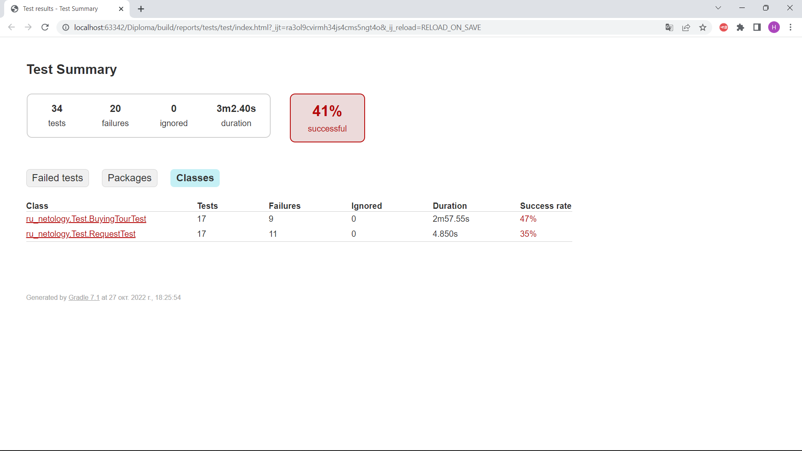

# **Отчет о проведенном тестировании**

# _**Дипломный проект — автоматизация тестирования комплексного сервиса, взаимодействующего с СУБД и API Банка**_

**1.Задача - автоматизировать тестирование веб-сервиса - приложения по покупке тура.**

  Составлено и проведено 17 тест - кейсов, в том числе
8 - успешных, 9 - неуспешных.

Тесты находятся по адресу [link text](src/test/java/ru_netology/Test/BuyingTourTest.java)

При написании тестов импользовалось : _Selenide_.

Для взаимодействия с приложением использовалась библиотека _rest-assured_.

**Расшифровка успешных тестов**

В процессе тестирования использовались следующие позитивные сценарии:
1. покупка тура с оплатой картой с валидными данными (1 тест)
2. покупка тура с оплатой в кредит по карте  с валидными данными (1 тест)

Эти тесты прошли успешно. Фактический  результат одобрения операции сооветствовал ожидаемому.

Также проверялись сценарии покупки тура с использованием карты с истекшим сроком действия (месяца или года)карты (4 теста).

Эти тесты также прошли успешно. Фактический результат с сообщением об истекших сроках соотвествовал ожидаемому.

В сценарии покупки тура по незарегистрированной карте ( 2 теста) фактический ответ приложения об отказе в одобрении также соответствовал ожидаемому.

**Расшифровка неуспешных тестов** 

Не прошли тесты с использованием:

1.заблокированной карты (2 теста)

2.карты с невалидным кодом (2 теста)

3.карты с невалидным именем владельца в виде цифр (2 теста)

4. карты с невалидным именем владельца в виде символов (2 теста)

Также не прошел тест на проверку соответствия суммы покупки, указанной на странице,  фактической.(1 тест)

Причина  неуспешных тестов - несоответствие фактического результата ожидаемому. 

По результатам этих тестов составлено  9 баг-репортов.

На скриншоте список неуспешных тестов:

 в том числе по классам:

Отчет о проведенных тестах с использованием _Gradle_ находится по адресу [link text](report/classes/ru_netology.Test.BuyingTourTest.html)

**2.Задача - проверить поддержку двух СУБД**.

По результатам запросов в базы данных установлено, что приложение поддерживается :
1. СуБД  **MySQL**.

2. СуБД  **PostgreSQL**, но с _**уточнением**_:
    Поддержка базы  есть, только с немного измененными настройками в файле _application.properties_:

- в задании было указано "spring.datasource.url=jdbc:mysql://localhost:3306/**_app_**"

- фактически использовалось spring.datasource.url=jdbc:postgresql://localhost:5432/**_postgres_**"

Для автоматизированной проверки правильности записи операций в базы данных было написано 17 тестов.

В том числе 6 -успешных, 11 - неуспешных.

Тесты находятся по адресу [link text](src/test/java/ru_netology/Test/RequestTest.java)

**Расшифровка успешных тестов**

- с использованием карты с валидными значениями (2 теста)
  Фактический результат об одобрении операции соответствовал ожидаемому.
- 
- с использованием заблокированной карты (2 теста)
  Фактический результат об отказе в операции соотвествовал ожидаемому.
- 
- с использованием незарегистрированной карты (2 теста)
  Фактический ответ об отказе в операции соответствовал ожидаемому.

**Расшифровка неуспешных тестов**

Не прошли тесты с использованием:

1.карты с невалидным годом действия (2 теста)

2.карты с невалидным месяцем действия (2 теста)

3.карты с невалидным кодом (2 теста)

3.карты с невалидным именем владельца в виде цифр (2 теста)

4. карты с невалидным именем владельца в виде символов (2 теста)

Также не прошел тест на проверку соответствия суммы покупки, указанной на странице,  фактической.(1 тест)

Причина  неуспешных тестов - несоответствие фактического результата ожидаемому.    
По результатам этих тестов составлено  11 баг-репортов.

Отчет о проведенных тестах с использованием _Gradle_ находится по адресу [link text](report/classes/ru_netology.Test.RequestTest.html)

Для подключения к базам данных  использовалась  библиотека _JDBC_. 

Для ручной проверки  информации в базе данных о том, успешно ли был совершён платёж и каким способом, использовался инструмент **DBeaver**

**СуБД MySQL**

СуБД **PostgreSQL**

